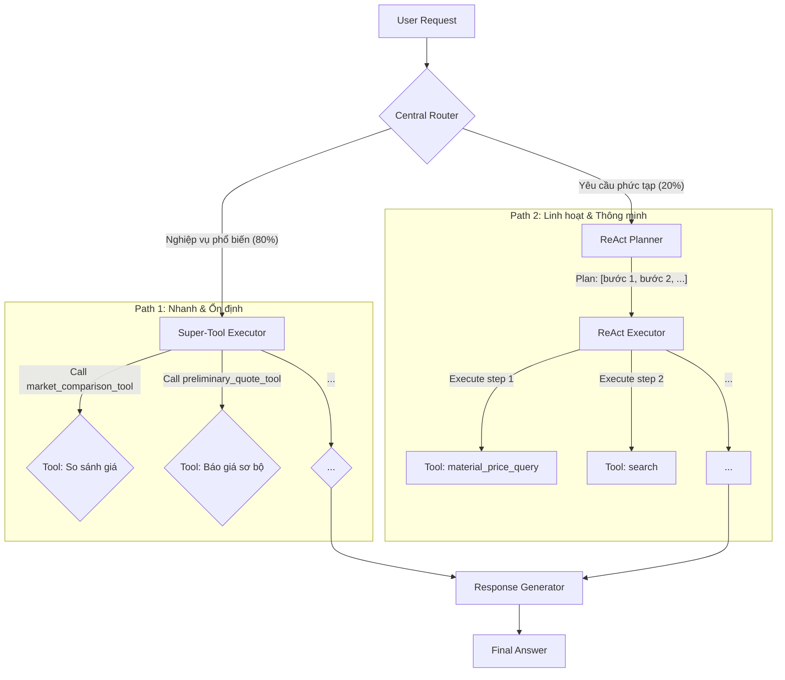

# Kế hoạch Triển khai: Hybrid Agent cho Chatbot Báo giá

## 1. Tổng quan Kiến trúc

Mục tiêu là xây dựng một kiến trúc agent **Hybrid (Lai)**, kết hợp những ưu điểm của hai phương pháp tiếp cận:

*   **Tool-Routing (Định tuyến Công cụ)**: Dành cho các nghiệp vụ phổ biến, được định nghĩa rõ ràng (5 nghiệp vụ chính). Luồng này đảm bảo tốc độ, tính ổn định và độ tin cậy.
*   **ReAct (Plan-and-Execute)**: Dành cho các yêu cầu phức tạp, đa bước hoặc nằm ngoài kịch bản. Luồng này đảm bảo sự linh hoạt, thông minh và khả năng xử lý các trường hợp edge-case.

### Sơ đồ Luồng Hoạt động



---

## 2. Kế hoạch Triển khai Chi tiết

### **Giai đoạn 0: Nền tảng và Chuẩn bị** `[HOÀN THÀNH]`

*Mục tiêu: Thiết lập các công cụ và cấu hình nền tảng để đảm bảo code sạch, dễ quản lý và giải quyết các vấn đề cốt lõi.*

#### **Task 0.1: Tạo Hàm Tiện Ích `cleanup_llm_output`** `[HOÀN THÀNH]`
*   **File cần sửa**: `src/react_agent/utils.py`
*   **Mô tả**: Tạo một hàm tiện ích tập trung để xử lý các vấn đề về định dạng output của LLM Qwen3.
*   **Chi tiết**:
    *   Đã tạo hàm `def cleanup_llm_output(text: str) -> str:`.
    *   Đã xử lý lỗi import và dependencies.

#### **Task 0.2: Xác thực Đường dẫn Dữ liệu `data_new`** `[HOÀN THÀNH]`
*   **File cần kiểm tra**: `src/react_agent/tools.py`
*   **Mô tả**: Đảm bảo rằng tất cả các tool truy cập file dữ liệu (ví dụ: `material_price_query`) đều đang trỏ chính xác đến thư mục `data_new`.
*   **Chi tiết**:
    *   Đã kiểm tra và xác nhận logic đường dẫn là chính xác.

---

### **Giai đoạn 1: "Bộ não" - Central Router** `[HOÀN THÀNH]`

*Mục tiêu: Xây dựng thành phần cốt lõi để phân tích ý định của người dùng và quyết định luồng xử lý phù hợp.*

#### **Task 1.1: Thiết kế `CENTRAL_ROUTER_PROMPT`** `[HOÀN THÀNH]`
*   **File cần tạo/sửa**: `src/react_agent/prompts.py`
*   **Mô tả**: Soạn thảo một prompt mới, có vai trò như "bộ não" phân loại. Prompt này phải hướng dẫn LLM trả về một đối tượng JSON có cấu trúc để định tuyến.
*   **Cấu trúc JSON đầu ra mong muốn**:
    ```json
    {
      "route": "<tên_luồng>", // "super_tool", "plan", hoặc "converse"
      "tool_name": "<tên_super_tool>", // Chỉ có khi route là "super_tool"
      "args": { ... } // Các tham số cho super_tool
    }
    ```
*   **Ví dụ trong Prompt**:
    *   **Input**: "so sánh giá gỗ sồi" -> **Output**: `{"route": "super_tool", "tool_name": "run_market_comparison", "args": {"material": "gỗ sồi"}}`
    *   **Input**: "báo giá chi tiết cho gỗ óc chó với diện tích 50m2, sau đó lưu lại báo giá với tên 'dự án A'" -> **Output**: `{"route": "plan"}`
    *   **Input**: "cảm ơn bạn" -> **Output**: `{"route": "converse"}`

#### **Task 1.2: Triển khai Node `central_router_node`** `[HOÀN THÀNH]`
*   **File cần sửa**: `src/react_agent/graph.py`
*   **Mô tả**: Tạo node đầu tiên trong graph, có nhiệm vụ thực thi prompt định tuyến.
*   **Chi tiết**:
    *   Đã triển khai `central_router_node` và cấu trúc graph với các node placeholder.
    *   Đã xác thực hoạt động của router qua unit test.

---

### **Giai đoạn 2: Xây dựng các Luồng Xử lý**

*Mục tiêu: Hiện thực hóa các nhánh xử lý mà Central Router đã quyết định.*

#### **Task 2.1: Luồng Nhanh - Triển khai Super-Tools** `[HOÀN THÀNH]`
*   **File cần sửa**: `src/react_agent/tools.py`, `src/react_agent/graph.py`, `src/react_agent/super_tools.py`
*   **Mô tả**:
    1.  **Tạo Super-Tools**: Đã tạo các hàm "siêu công cụ" và tách logic ra file `super_tools.py`.
        *   `run_preliminary_quote` `[HOÀN THÀNH]`
        *   `run_detailed_quote` `[HOÀN THÀNH]`
        *   `run_market_comparison` `[HOÀN THÀNH]`
        *   `run_image_quote` `[HOÀN THÀNH]`
        *   `run_quote_management` `[CHƯA TRIỂN KHAI]`
    2.  **Tạo Node Executor**: Đã triển khai `super_tool_executor_node`. `[HOÀN THÀNH]`
    3.  **Tạo Node Response Generator**: Đã triển khai `response_generator_node`. `[HOÀN THÀNH]`
*   **Chi tiết**:
    *   Đã triển khai hầu hết các super-tools và các node cần thiết.
    *   Đã tái cấu trúc code, tách `super_tools.py` để dễ quản lý.
    *   Đã xác thực các luồng hoạt động qua unit test và integration test.

#### **Task 2.2: Luồng Linh hoạt - Triển khai ReAct Planner/Executor** `[ĐANG TRIỂN KHAI]`
*   **File cần sửa**: `src/react_agent/graph.py`, `src/react_agent/prompts.py`
*   **Mô tả**: Thay thế `planner_node` placeholder bằng một vòng lặp ReAct hoàn chỉnh.
*   **Chi tiết**:
    1.  **Triển khai Node Lập kế hoạch (`plan_step_node`)**:
        *   Sử dụng `PLAN_PROMPT` để phân tích yêu cầu phức tạp của người dùng thành một danh sách các bước có thể thực hiện.
        *   Lưu kế hoạch vào `state['plan']`.
    2.  **Triển khai Node Thực thi (`execute_step_node`)**:
        *   Lấy bước hiện tại từ kế hoạch.
        *   Sử dụng `EXECUTOR_PROMPT` để hướng dẫn LLM chọn công cụ (`tool`) phù hợp nhất từ danh sách `TOOLS` để hoàn thành bước đó.
        *   Thực thi công cụ và lưu kết quả vào `state['past_steps']`.
    3.  **Triển khai Logic Điều kiện (`should_continue`)**:
        *   Tạo một hàm điều kiện để kiểm tra xem kế hoạch đã hoàn thành chưa.
        *   Nếu còn bước, quay lại `execute_step_node`.
        *   Nếu đã xong, đi đến `response_generator_node`.
    4.  **Cấu trúc lại Graph**:
        *   Nối `central_router` với `plan_step_node`.
        *   Tạo vòng lặp: `plan_step_node` -> `should_continue` -> `execute_step_node` -> `should_continue`.
        *   Nối đầu ra của vòng lặp với `response_generator_node`.

#### **Task 2.3: Luồng Trò chuyện - Node Conversational Responder** `[HOÀN THÀNH]`
*   **File cần sửa**: `src/react_agent/graph.py`
*   **Mô tả**: Tạo một node đơn giản để xử lý các cuộc hội thoại không cần nghiệp vụ.
*   **Chi tiết**:
    *   Đã triển khai logic thực tế cho `conversational_responder_node`.
    *   Đã xác thực hoạt động qua unit test.

---

### **Giai đoạn 3: Lắp ráp Graph và Hoàn thiện**

*Mục tiêu: Kết nối tất cả các thành phần đã xây dựng thành một hệ thống hoàn chỉnh và đảm bảo tính toàn vẹn của dữ liệu đầu ra.*

#### **Task 3.1: Cấu hình `StateGraph`**
*   **File cần sửa**: `src/react_agent/graph.py`
*   **Mô tả**: Lắp ráp graph theo kiến trúc Hybrid.
*   **Chi tiết**:
    *   Xóa cấu trúc graph cũ.
    *   Đặt `central_router_node` làm điểm bắt đầu (`set_entry_point`).
    *   Sử dụng `add_conditional_edges` để rẽ nhánh từ `central_router_node` dựa trên giá trị của `state['route']`.
    *   Luồng "super\_tool" sẽ đi từ `central_router_node` -> `super_tool_executor_node` -> `response_generator_node`.
    *   Luồng "plan" sẽ đi từ `central_router_node` -> `plan_step` -> `execute_step` (với vòng lặp) -> `response_generator_node`.
    *   Luồng "converse" sẽ đi từ `central_router_node` -> `conversational_responder_node` -> `END`.
    *   Tạo node `response_generator_node` có nhiệm vụ tổng hợp kết quả từ các luồng và định dạng câu trả lời cuối cùng.

#### **Task 3.2: Triển khai "Chốt chặn cuối"**
*   **File cần sửa**: `app.py`
*   **Mô tả**: Thêm một lớp bảo vệ cuối cùng để đảm bảo không có định dạng lỗi nào bị rò rỉ ra giao diện người dùng.
*   **Chi tiết**:
    *   Trong hàm `query_agent`, tại dòng trả về kết quả `return jsonify(...)`.
    *   Trước khi trả về, gọi `cleanup_llm_output(ai_message.content)` một lần cuối cùng cho `response`.

---
## 3. Kết luận
Kế hoạch này cung cấp một lộ trình rõ ràng để xây dựng một agent mạnh mẽ, cân bằng giữa hiệu suất và sự linh hoạt. Bằng cách tuân thủ kế hoạch này, chúng ta sẽ tạo ra một sản phẩm đáng tin cậy, dễ bảo trì và có khả năng giải quyết hiệu quả các bài toán nghiệp vụ đã đặt ra. 